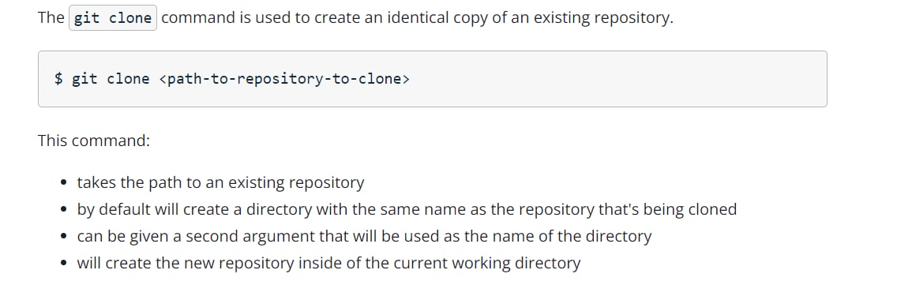
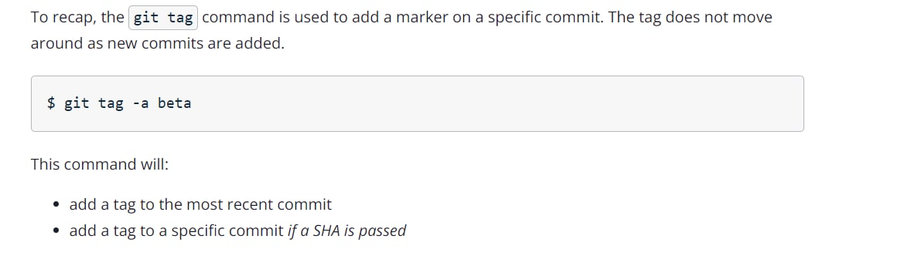
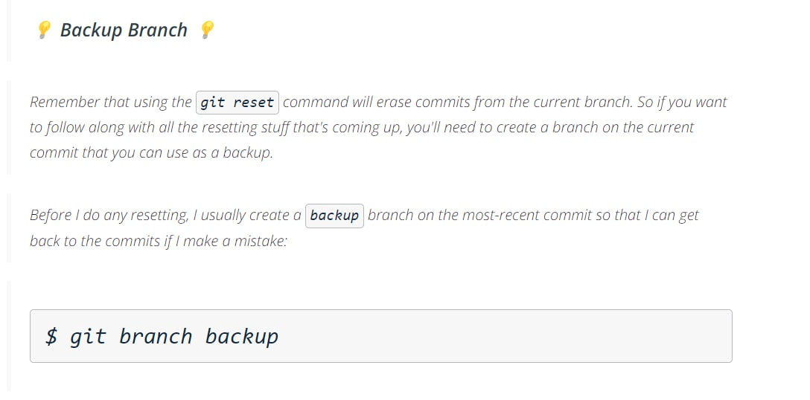

git is used to maintian the history of a project. And all this history is stored inside a hidden directory called .git, To intialize a directory as a git repository, run the following -
```
git init -> creates a .git folder 
```

Suppose we create a new file named test.txt inside our working directory. Now, this file is untracked as of now i.e. Noone knows that we have created a file named test.txt . We can check the status using the command -
```
git status -> list the status of changes inside the git repo
```
Now, Imagine a wedding scenario where the photographer is clicking pictures of guests on stage. So, this is kinda similar - we are first moving the changes to the staging area from where their picture can be clicked and the command for the same is as follows -
```
git add . -> adds all the untracked files to the staging area
git add test.txt -> adds the file test.txt to the staging area
```
Then, the photographer clicks the picture of the guests on stage, so this step is similar to that, we are commiting the changes i.e. saving their snapshot.
```
git commit -m "added file test.txt" -> commits the changes i.e. saves the snapshot of these changes
```


Now, suppose we have moved some files to the staging area but now we don't wanna commit them, so we have to remove them from the staging area, for that we run the following command -
```
git restore --staged test.txt -> removes the file named test.txt from the staging area
```
To see the history of project i.e. to see what all commits were made into the project, we run the following command -
```
git log
```


Now, let's suppose we deleted a file named test.txt - 
```
rm test.txt
```
git will detect this change and when we run git status - we can see that this change is intially untracked. So, we will run git add to move it to the staging area and then commits this change as -
```
git add test.txt
git commit -m "deleted test.txt"
```
what if I wanna undo the above change i.e. move back to the time when I have not deleted 'test.txt'. To do so, we move back to a commit earlier than the commit, we wanna remove. So, run git log and copy the commit id of the commit to which we wanna move to. And then run the following command -
```
git reset e1858f13759f7ea6a06b2e80850abbdc09a9e01c -> moves our repo to the specified commit, deleting all the commits ahead of it and unstages the changes made after this commit.
```
Now, the above command will only remove the commits, it will not undo the changes that means the changes are still there but untracked. So, if we want to undo the changes, we have to discard the untracked changes in our working directory, for that run the following command - 
```
git restore test.txt -> discards the changes in working directory that means now the file is restored back which was deleted earlier. 
```
Now, suppose we have some untracked changes and we don't wanna commit them as well as remove them so what we can do is to stash them i.e. asking some people that hey your picture has not been taken, go to the backstage and come back later when we call u. Or let's say, we are working on a project/feature and we have a few lines of code that we have worked upon but now we wanna try out something new with a clean codebase i.e. all the files/changes that we have worked up -> we want to remove them but we also don't want to remove them permanently or save them with a new commit, we wish that there could be a way where we can put these changes temporarily without making a commit/history in the project and whenever we want them back, we could easily get them. To do so, we use a command called -
```
git stash -> moves all the staged or untracked changes somewhere temporarily. And restores the repo to the last commited state.
```
```
git stash pop -> brings the previously stashed changes back into the repo in the state as they were before stashing
```
git stash doesn't work for untracked files. To stash untracked files, first add them to staging area then stash them.

```
git stash clear -> clear the stash that means the changes inside the stash are removed/lost permanently
```
```
git stash list -> lists all the stash instances that we have along with their corresponding stash indices.
```
```
git stash show -> shows the contents of the most recent stash
```
```
git remote add origin repo_url -> binds a remote repo whose url is specified, to our local repo and name that remote repo as origin
```
```
git remote -v  -> lists our current remote connections/repo along with their urls
```
```
git push origin master -> push our local commited changes to the master branch of remote repo whose name is origin
```



`HEAD` is you. It points to whatever you checked out, wherever you are. Typically that is not a commit, it is a branch. If `HEAD` does point to a commit (or tag), even if it's the same commit (or tag) that a branch also points to, you (and `HEAD`) have been detached from that branch. Since you don't have a branch attached to you, the branch won't follow along with you as you make new commits. `HEAD`, however, will.

In open source, we first fork (basically creates a copy of our own) the repo we want to contribute to and then copy the url of our forked/copied repo and add it as the 'origin' in our local/cloned project. And we add the url of original project/repo as 'upstream' in our cloned project. This is by convention. 
```
git remote add origin personal_copy_url
git remote add upstream original_repo_url 
```
To create a new branch, use the following command - 
```
git branch branch_name
```


Checkout a branch as -
```
git checkout branch_name -> this will make the HEAD to point to the branch specified. All commits we will make now, will go on to the branch specified here.
```


It's very important to know which branch you're on when you're about to merge branches together. Remember that making a merge makes a commit.


To get the changes on our forked repo to be merged in the master(main) branch of the original repo, we create a pull request -> requesting the owner of original project to merge our changes

If a branch already has a pull request associated with it, it will not allow us to create a new pull request for a new commit. All the commits will automatically be added to that pull request only. In simple terms, "One Branch means One Pull Request".

That's why, for every new feature/bug, always create a new branch because for every feature/bug, we need a separate PR.

Now, let us suppose, we had two commits on the remote and now on our local, we removed a commit using the reset command and later on removed the untracked changes as well. Now, we have only one commit on local but two commits on remote. So, if we wanna push now, we had to do force push as:
```
git push origin branch_name -f  -> this will remove that commit from the remote repo as well.
```
 To maintain forked repo with original repo, we can do it in either of the two ways - 
 ```
 On local - 
 git checkout master
 git fetch --all --prune  -> fetches all the changes from remote repositories and stores them in a separate branch in our local repo. (--all means fetch all branches) (--prune means delete the refs to branches that don't exist on the remote. This is highly desirable when working in a team workflow in which remote branches are deleted after merge to `main).
 git reset --hard upstream/master   -> this will delete all our local changes to master and reset it to the master branch of upstream.
 git push origin master  -> we push the changes that we get from upstream in prev command, to our forked repo master branch.
```


Another way could be -
 ```
 On local -
 git checkout master
 git pull upstream main -> fetches the changes from master(main) branch of upstream and merges them into our local master branch
 git push origin main -> push the changes on our local master branch to origin master branch
 ```

Now, let's learn how to merge multiple commits into a single commit also known as squashing commits.

```
Note - whenever we create a new branch, it's created from the point where our HEAD is currently pointing at.
```

One way is to first use the reset command, which will remove the commits ahead of the commit_id, we specified and unstage those changes. And now, we can commit them again in a single commit.

Another way is - 
```
git rebase -i commit_id -> this will open an interactive mode with all the commits ahead of the commit_id specified. And now, we can either pick or squash a commit. 
```


In the above image, 2nd and 3rd commit from top will be merged onto the 1st commit i.e. whichever pick commit is behind them. After we save and close the file, we will be prompted to add a commit message.
And this one commit message will replace all the squashed commit messages + the commit that they are merged into.

Merge Conflicts occur when two separate branches have made edits to the same line in a file, or when a file has been deleted in one branch but edited in the other. These can be resolved by choosing whichever change we wanna proceed with and deleting rest of the changes.


Undo the changes - 





