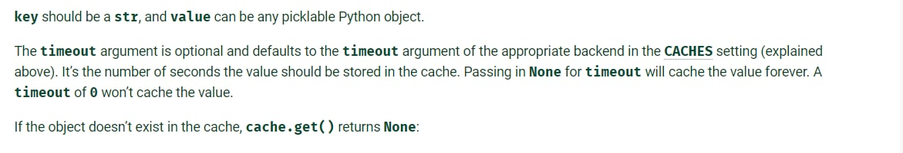
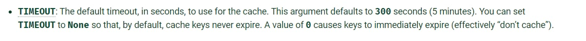
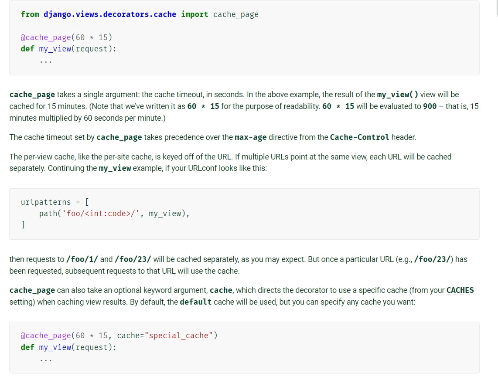
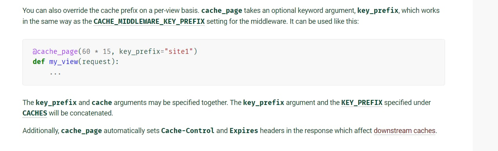
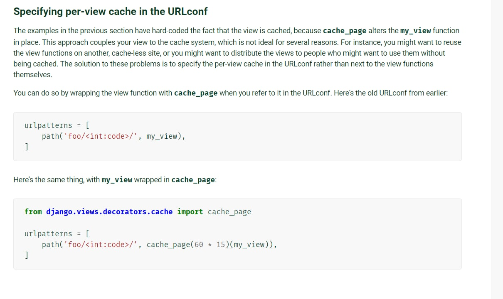

redis is a type of database, most importantly a non-sql db. All of the data in redis is stored in key value pairs. Unlike a normal database that runs on a disk and stores all of our information on the disk, redis actually works inside of our working memory(ram) on the computer which makes redis incredibly fast but it's also volatile at the same time. That's why redis is not used as a persistent data store instead it's used for caching.

```
SET name kyle -> stores value, "kyle" inside key, "name".
GET name -> returns the value of key, "name".
```
Pretty much everything that we store inside of redis, it's going to be a type of string by default.

```
DEL name  -> deletes the value stored inside of key, "name"
GET name -> returns (nil)
```
```
EXISTS name -> returns true(1) or false(0) depending upon the key exists or not. Since, we used DEL command on key "name" above, this returns us 0 meaning the key doesn't exist.
```
```
KEYS * -> returns all the keys, that are present currently inside of the db
flushall -> removes all keys from the db
```
```
ttl key_name -> returns the time-to-live i.e. the lifespan of a key inside the db. -1 means the key would live forever.
expire key_name 10 -> the key specified will get expired in 10s.
setex key_name time value -> we can specify the ttl for a key while defining the key as well using the setex command.
```
we can also store list, sets and hashes inside redis. let us see list first -
```
lpush list_name value -> pushes the value inside of the list specified ( lpush means left push )
rpush list_name value -> pushes the value inside of the list specified ( rpush means right push )
get list_name -> will give an error since get only works for strings. 
lrange list_name 0 -1 -> prints out the whole list
lpop list_name -> pops out the left most element from the list
rpop list_name -> pops out the right most element from the list
Application -> suppose we wanna store the 5 most recent messages sent out on our messaging app. To do so, we use a list to push and pop the elements respectively.
```
Now, let's see how we can store a set inside of redis -
```
SADD  set_name value -> adds the value to the set specified. 
SADD hobbies "weight lifting" -> adds "weight lifting" inside set, hobbies. Since the value contains more than one word that's why, we used "". this returns 1 meaning the value is added successfully.
SADD hobbies "weight lifting" -> if we run it again, this time, it returns 0 meaning the value is not added to the set.
SMEMBERS set_name -> prints out all values of the set specified.
```
Hashes - 
```
HSET  hash_name key value -> add the key-value pair inside of the hash specified.
HGET hash_name key -> returns the value of key stores inside of this hash.
HGETALL hash_name -> prints all the key-value stored inside of the specified hash. first key then value.
HDEL hash_name key -> deletes the key specified from the hash.
HEXISTS hash_name key -> returns 1 or 0 depending upon the key is present inside of the hash or not. 
```

In Django, we can use redis as - 
```
pip install django-redis
```
Inside settings.py - 
```
CACHES = {
    "default": {
        "BACKEND": "django_redis.cache.RedisCache",
        "LOCATION": "redis://127.0.0.1:6379/1",
        "OPTIONS": {
            "CLIENT_CLASS": "django_redis.client.DefaultClient",
        }
    }
} 

# Also, define a global var for ttl if u want -
CACHE_TTL = 60 * 1500 
```


Inside views.py - 
```
from django.core.cache import cache
from django.core.cache.backends.base import DEFAULT_TIMEOUT

# if we wanna use the global ttl var here, then also import
from django.conf import settings 


CACHE_TTL = getattr(settings, 'CACHE_TTL', DEFAULT_TIMEOUT)

cache.set("foo", "value", timeout=25)

cache.ttl("foo") -> 25
cache.ttl("not-existent") -> 0
```

<br>

<br>





An example of using redis with django - 
```
from django.core.cache import cache

if cache.get(recipe_id):
	recipe = cache.get(recipe_id)
	print("found inside redis, no need to check db")
else:
	recipe = Recipe.objects.get(pk=recipe_id)
	cache.set(recipe_id, recipe)
	print("not found inside redis, get it from db and store it inside redis")
```


